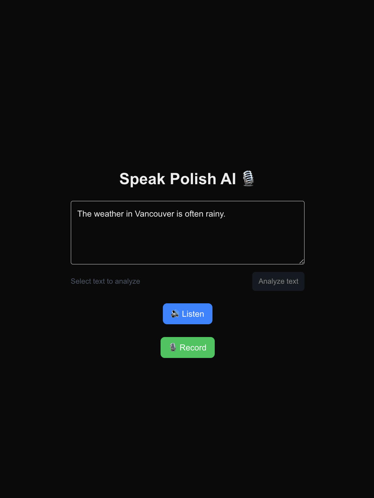
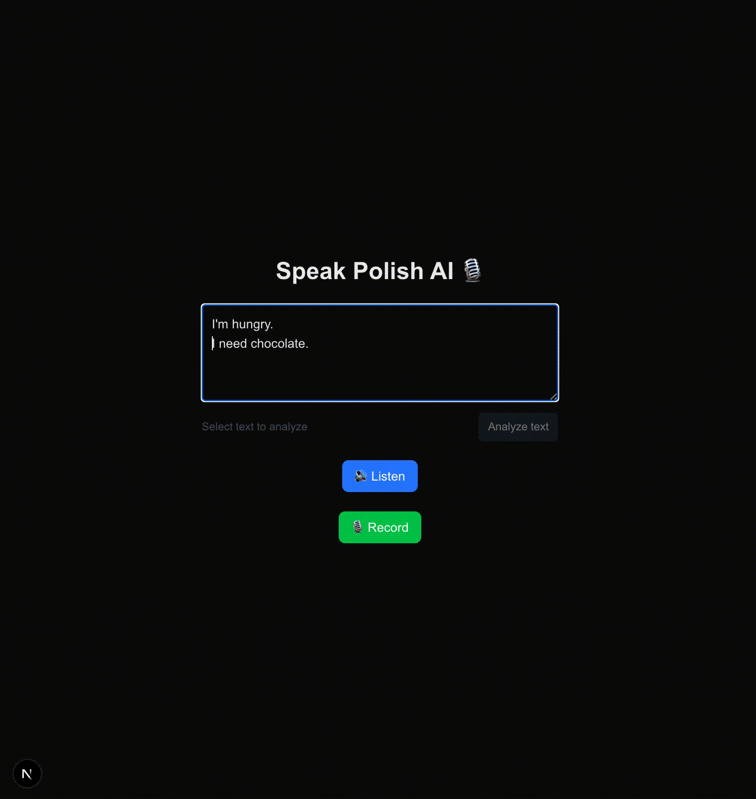
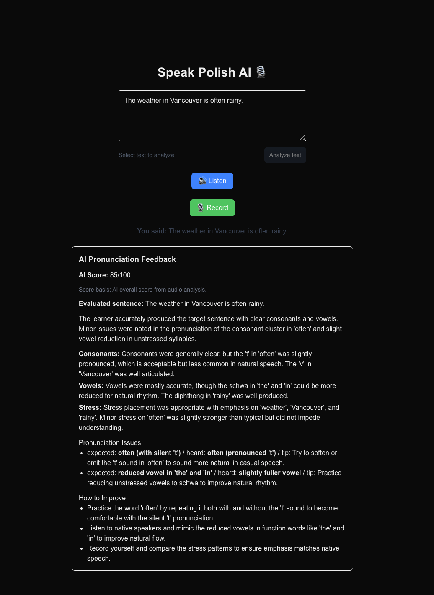

# Speak Polish AI

I packed this app with the exact features I wished I had while learning English!

Live Demo: https://speak-polish-ai.vercel.app/

AI-powered English practice app with:

- Pronunciation feedback from recorded audio
- Natural `Listen` playback using OpenAI TTS (with browser voice fallback if TTS fails)
- Grammar explanation and rewrite suggestions for selected text selection only

## Product Tour

### 1. Practice Screen

Write or paste a sentence, listen to natural TTS playback, and record your voice.



### 2. Grammar Rewrite (Selected Text)

Quick walkthrough of selection -> analysis -> suggestion apply.



### 3. Pronunciation Feedback

After recording, the app shows an AI score with concrete feedback for consonants, vowels, and stress.



## Setup

Create `.env.local`:

```bash
OPENAI_API_KEY=your_api_key

# Optional
OPENAI_AUDIO_ANALYSIS_MODEL=gpt-4o-audio-preview
OPENAI_MODEL=gpt-4.1-mini
OPENAI_TRANSCRIBE_MODEL=gpt-4o-mini-transcribe
OPENAI_TEXT_FEEDBACK_MODEL=gpt-4.1-mini
OPENAI_TTS_MODEL=gpt-4o-mini-tts
OPENAI_TTS_VOICE=alloy
```

## Getting Started

```bash
npm install
npm run dev
```

Open `http://localhost:3000` in your browser.

## How It Works

1. Enter the sentence you want to practice.
2. Tap `Listen` to hear natural TTS audio generated by OpenAI (`/api/tts`).
3. Tap `Record` and speak.
4. The app sends microphone audio and the target sentence to `/api/pronunciation-feedback`.
5. Audio is analyzed directly by OpenAI for score and pronunciation comments.
6. If direct audio analysis fails, the API falls back to transcription-based analysis.
7. You can select text in the textarea and tap `Analyze text` to get grammar explanations and rewrite suggestions for the selected range from `/api/text-feedback`.
8. Tap `Apply this suggestion` to replace the selected text directly.

## Notes

- Pronunciation scoring is AI-driven and includes guardrails to prevent high scores for unrelated/non-English speech.
- This is not a phoneme-level lab-grade scoring system.
- Browser support depends on `MediaRecorder` and microphone permissions.
