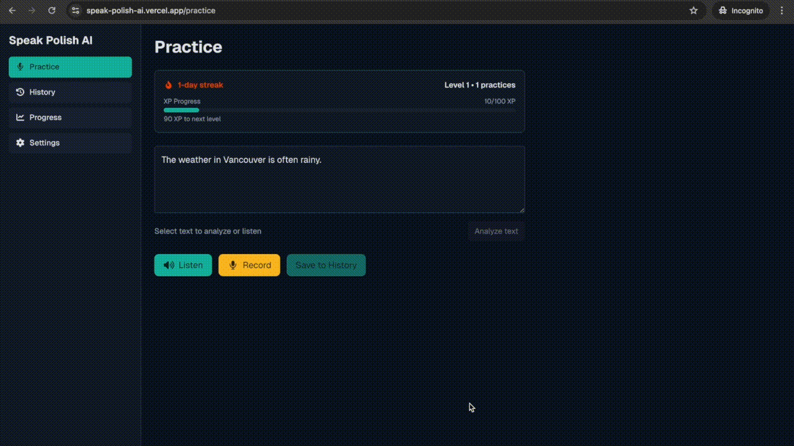

# Speak Coach AI

🔗 Live Demo: https://speak-polish-ai.vercel.app/

AI-powered pronunciation training app that helps non-native speakers improve their speaking skills through real-time feedback.

As a non-native English speaker, I struggled to get clear, actionable feedback on my pronunciation — so I built a tool that combines speech input, AI analysis, and instant feedback into a simple daily practice experience.

This project focuses on delivering a smooth user experience for a complex AI-driven interaction.

## Overview

Speak Coach AI is a pronunciation training app focused on helping non-native speakers practice speaking with immediate AI feedback.

It combines speech input, AI analysis, and progress tracking into a simple daily learning experience.

## Tech Stack

- React / Next.js
- TypeScript
- OpenAI API (TTS, transcription, feedback)
- Tailwind CSS
- Storybook
- Vercel (deployment)

## Why This Product

Many language learners lack immediate feedback when practicing speaking.

This app focuses on:

- Real-time pronunciation feedback
- Repeatable daily practice
- Motivation through progress tracking

The goal is to make speaking practice more accessible and consistent.

## User Flow

1. User enters or pastes a sentence
2. Listens to native-like pronunciation via TTS
3. Records their own voice
4. Receives AI-generated pronunciation feedback and score
5. Saves results and tracks progress over time

## Product Tour

### 1. Practice Screen

Write or paste a sentence, listen to natural TTS playback, and record your voice.



#### Quick Steps (demo.gif)

1. Type a sentence in the textarea.
2. Click `Listen` to hear native-like playback.
3. Select a word or phrase and click `Listen Selection` to replay only that part.
4. Click `Record`, speak, then click `Stop`.
5. Review AI pronunciation feedback and save the result to history.

### 2. History Screen

Review your saved practice sessions in one place.

- Check your past sentence, correction, and pronunciation score.
- Track what you practiced recently.
- Keep a simple daily learning log.

### 3. Progress Screen

See your learning momentum at a glance.

- View your streak and total practice count.
- Confirm current level and XP progress.
- Stay motivated with visible growth over time.

### 4. Settings Screen

Adjust your app environment and learning workflow.

- Access theme and UI preferences.
- Manage practice-related options from one page.
- Keep your setup consistent across sessions.

## Frontend Engineering Focus

This project emphasizes frontend-driven product development:

- Designing a clear user journey from input → feedback → progress tracking
- Handling complex asynchronous states (recording, playback, API responses)
- Building responsive, mobile-first UI for real-world usage
- Integrating browser APIs (MediaRecorder) for audio interaction
- Creating intuitive UX for AI-powered features

## Setup

Node.js `20+` is required.

```bash
node -v
```

Create `.env.local`:

```bash
OPENAI_API_KEY=your_api_key

# Optional
OPENAI_AUDIO_ANALYSIS_MODEL=gpt-4o-audio-preview
OPENAI_MODEL=gpt-4.1-mini
OPENAI_TRANSCRIBE_MODEL=gpt-4o-mini-transcribe
OPENAI_TEXT_FEEDBACK_MODEL=gpt-4.1-mini
OPENAI_TTS_MODEL=gpt-4o-mini-tts
OPENAI_TTS_VOICE=alloy
```

## Getting Started

```bash
npm install
npm run dev
```

Open `http://localhost:3000` in your browser.

## How It Works

1. Enter the sentence you want to practice.
2. Tap `Listen` to hear natural TTS audio generated by OpenAI (`/api/tts`).
3. Tap `Record` and speak.
4. The app sends microphone audio and the target sentence to `/api/pronunciation-feedback`.
5. Audio is analyzed directly by OpenAI for score and pronunciation comments.
6. If direct audio analysis fails, the API falls back to transcription-based analysis.
7. You can select text in the textarea and tap `Analyze text` to get grammar explanations and rewrite suggestions for the selected range from `/api/text-feedback`.
8. Tap `Apply this suggestion` to replace the selected text directly.
9. Save results to history and keep your streak/level progress moving.

## Learning Motivation UX

- `Streak`: calculated from saved daily practice history
- `Level`: XP-based progression from saved sessions
- `90+ Score Celebration`: special UI appears when pronunciation score reaches 90 or higher

## Notes

- Pronunciation scoring is AI-driven and includes guardrails to prevent high scores for unrelated/non-English speech.
- This is not a phoneme-level lab-grade scoring system.
- Browser support depends on `MediaRecorder` and microphone permissions.
- Streak/level stats are stored in browser `localStorage`.

## Challenges & Decisions

- Designed a fallback mechanism for unreliable audio analysis by switching from direct audio processing to transcription-based evaluation
- Managed complex asynchronous UI states for recording, playback, and feedback
- Simplified user interaction for complex AI features through focused UX design

## Key Features

### 🎤 Speaking Practice

- Record voice and receive pronunciation feedback
- AI-generated scoring and suggestions

### 🔊 Listening Support

- Natural TTS playback
- Partial playback for selected text

### 📈 Learning Motivation

- Streak tracking
- Level progression
- Score-based feedback

### 📝 Text Feedback

- Grammar explanations for selected text
- Rewrite suggestions

## Takeaways

This project strengthened my ability to design user-focused interfaces and handle real-world complexity in frontend applications involving AI and media interactions.
